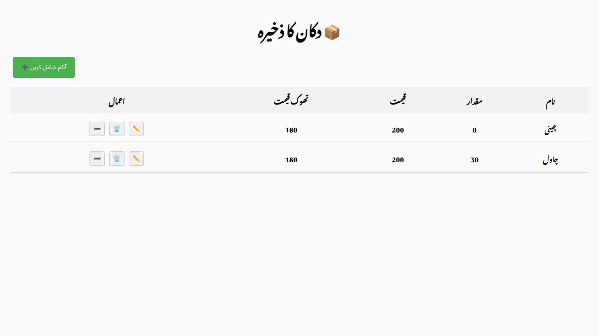

# 🛍️ Shop Management Frontend

This is the React + Vite frontend for the Shop Management Web App.
It provides a simple Urdu-based interface to manage items in the inventory (add, update, sell, delete).

---

## 🚀 Features

- 📦 View all inventory items
- ➕ Add new items
- ✏️ Update existing items
- ➖ Sell / decrease quantity
- 🗑️ Delete items (with confirmation)
- 🌐 Fully responsive and Urdu-based UI

---

## 📂 Project Structure
```
frontend/
├── public/              # Static assets
├── src/                 # React source code
│   ├── api.js           # API calls to FastAPI backend
│   ├── App.jsx          # Main React component
│   ├── ActionMenu.jsx   # (optional) Menu for actions
│   ├── index.css        # Global styles
│   ├── main.jsx         # React entrypoint
│   └── assets/          # Images/icons
├── package.json         # Dependencies
├── vite.config.js       # Vite config
└── index.html           # App HTML template
```

---

## ⚙️ Installation & Setup

1️⃣ Navigate to frontend folder:
  ```bash
  cd frontend
  ```
2️⃣ Install dependencies:
  ```bash
  npm install
  ```
3️⃣ Run the development server:
  ```bash
  npm run dev
  ```

The frontend will run on:
👉 http://127.0.0.1:5173/

---

## 🖼️ Screenshots
